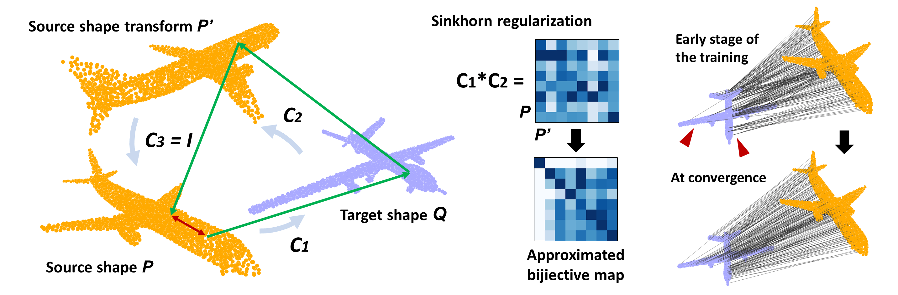
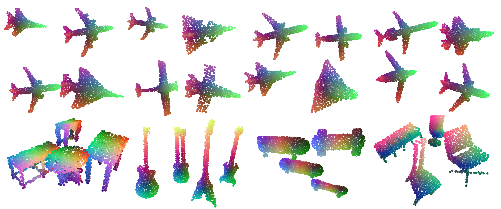
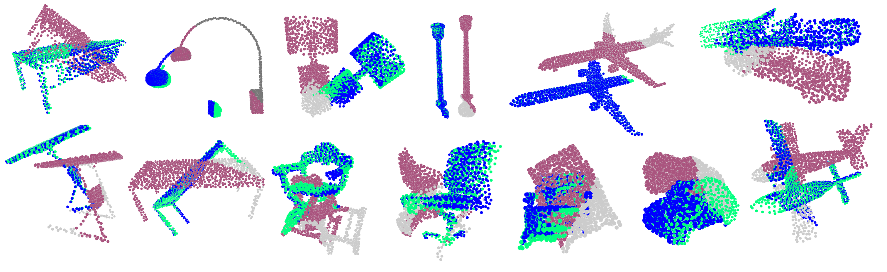
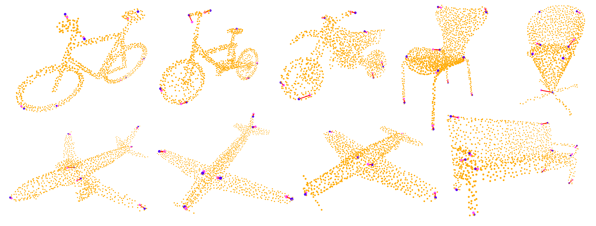
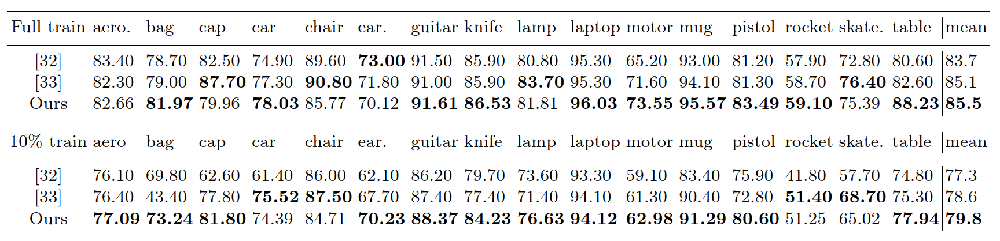
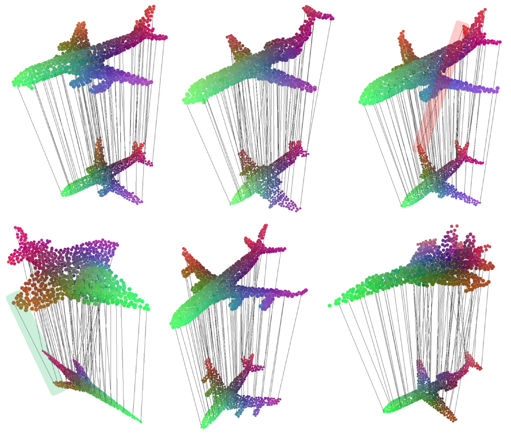

# Mapping in a Cycle: Sinkhorn Regularized Unsupervised Learning for Point Cloud Shapes

This repo is the official implementation of the paper [Mapping in a Cycle](https://arxiv.org/pdf/2007.09594.pdf) accepted to [ECCV2020](https://eccv2020.eu/).



**PAPER ABSTRACT** 

We propose **an unsupervised learning framework** with the pretext task of **finding dense correspondences** between point cloud shapes from the same category based on **the cycle-consistency formulation**. 
In order to learn discriminative pointwise features from point cloud data, we incorporate in the formulation **a regularization term based on Sinkhorn normalization** to enhance the learned pointwise mappings to be as bijective as possible. 
Besides, a random rigid transform of the source shape is introduced to form a triplet cycle to improve the model's robustness against perturbations. 
Comprehensive experiments demonstrate that the learned pointwise features through our framework benefits various point cloud analysis tasks, e.g. partial shape registration and keypoint transfer. 
We also show that the learned pointwise features can be leveraged by supervised methods to improve the part segmentation performance with either the full training dataset or just a small portion of it.

## How to use this repository

**Setup**: I run the code with Python 3.7.5, pytorch 1.3.1 (cuda10.1) and torchvision 0.4.2. You should be able to run the code by installing all packages upon request by the code. 
I trained all the models with a single GPU card (RTX2080Ti or GTX1080Ti); so if you want to parallel the code, you need to revise the code with `torch.nn.DataParallel` to enable parallel computing. Please refer to the [code base](https://github.com/jamt9000/DVE) for reference.

**Configure the code**: The hyperparmaeters are set from the config file in the folder `./configs` and their meanings should be self-explanatory.
Our model is trained in a category-specific manner. So you need to specify which data category to train with `SHAPE_CATEGORY`.

Four sub-folders are in the folder `./configs`, i.e., `unsupervised_pretrain`, `registration`, `segmentation`, and `evaluation`. 

### 1) To perform model pretraining with the ShapeNetPart dataset

#### Training:

```
python train_pointcloud.py --config configs/unsupervised_pretrain/sab_pointnet_{SHAPE_CATEGORY}.json
```

#### Evaluation of cycle correspondences:

```
python valid_all_in_one.py --config configs/evaluation/valid_all_in_one.json --resume pretrained_ckpts/pretrained/{SHAPE_CATEGORY}/checkpoint-epoch70.pth --task_type correspondence
```

To correctly run the evaliation code, you need to set the data category in the config file as well. I currently provided a pretrained model on the Airplane data. More pretrained models will be released later.

#### Registration task on ShapeNetPart models:

I also provide a script code to test on the registration task (with rotation angle raning from -45 to 45 degree) with respect to the `airplane` data using the model pretrained with augmented rotations from [-15, 15] degree. 

```
python test_main.py --config configs/evaluation/valid_all_in_one.json --resume pretrained_ckpts/pretrained/airplane/checkpoint-epoch70.pth --task_type registration
```

### 2) To fine-tune the pretrained model for partial-to-partial shape registration task on ModelNet40

Since the ModelNet40 dataset contains non-aligned data, we finetune the model pretrained on the ShapeNetPart dataset.

- First, we need to mitigate the domain gap between ShapeNetPart and ModelNet40.
To this end, we train the model on ModelNet40 by first setting the rotation angle range to [-15 deg, 15 deg].

- After that, we want to be able to perform shape registration that covers the rotationa angle range of [-45 deg, 45 deg]. 
So we continue training the model with this rotation angle range.

#### Training: 

```
python finetune_registration_modelnet.py --config configs/registration/modelnet_sab_pointnet_{SHAPE_CATEGORY}.json --resume {PATH_TO_PRETRAINED_CHECKPOINT.pth}
```

#### Evalation:

```
 python test_main.py --config configs/evaluation/valid_all_in_one_modelnet.json --resume pretrained_ckpts/registration/modelnet40_{CATEGORY}/checkpoint-epoch70.pth --task_type registration
```

### 3) To train PointNet++ with the pretrained features for ShapeNetPart segmentation task

#### Training: 

```
python train_segmentation.py --config configs/segmentation/sab_pointnet_{SHAPE_CATEGORY}.json --pretrain pretrained_ckpt/pretrained/{SHAPE_CATEGORY}/{PATH_TO_CHECKPOINT.pth}
```

You can use keyword `--truncated_dataset` with `{PERCENTAGE:FLOAT}` to specify training with a fraction of data. This will randomly sample a fraction of data and use them to build the dataloader for training, e.g. `--truncated_dataset 0.10` using 10% of the labeled data for training.

#### Evaluation:

```
python valid_all_in_one.py --config configs/evaluation/{config_file}.json --resume {PATH_TO_CKPT.pth}
```

### 4) Reproducing the ablation results

All network/loss configurations are given in the corresponding config files:

##### without $L_S$

```
python train_pointcloud.py --config configs/unsupervised_pretrain/sab_pointnet_{SHAPE_CATEGORY}_no_ls.json
```

##### replacing $L_S$ with $L_I$

```
python train_pointcloud.py --config configs/unsupervised_pretrain/sab_pointnet_{SHAPE_CATEGORY}_replace_ls.json
```

##### without self-attention modules

```
python train_pointcloud.py --config configs/unsupervised_pretrain/sab_pointnet_{SHAPE_CATEGORY}_no_selfattention.json
```

##### without normal vectors as input

```
python train_pointcloud.py --config configs/unsupervised_pretrain/sab_pointnet_{SHAPE_CATEGORY}_no_normal.json
```

## Results in various point cloud applications

0. Learned Pointwise Features visualized using t-SNE



1. Partial-to-Partial Shape Registration



2. Unsupervised Keypoint Transfer



3. ShapeNetPart Segmentation



4. Pretext: Dense Correspondences between Shapes




## Contact

If you have any questions, please feel free to drop an email: yanglei.dalian@gmail.com

## Credits to the public repository that this repository relies on:

1. The code base is derived from https://github.com/jamt9000/DVE

2. The pointnet++ code is derived from https://github.com/yanx27/Pointnet_Pointnet2_pytorch

3. The set transformer code is derived from https://github.com/juho-lee/set_transformer

4. ShapeNetPart Dataset: http://web.stanford.edu/~ericyi/project_page/part_annotation/index.html

5. ModelNet40 Dataset: https://modelnet.cs.princeton.edu/

Thank them for sharing their codes and data!